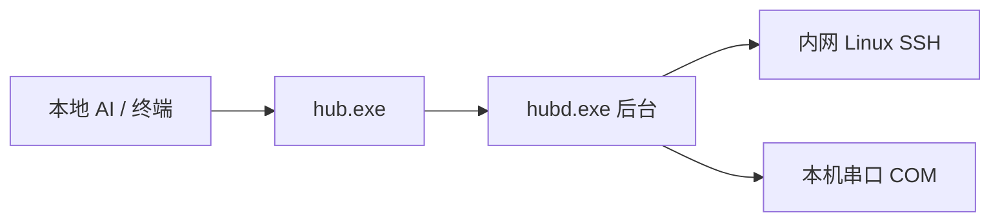

# Deckhand

[](https://github.com/huangyu6572/deckhand/actions/workflows/ci.yml)
[](https://github.com/huangyu6572/deckhand/releases/latest)
[](https://github.com/huangyu6572/deckhand/releases/latest)
[](https://github.com/huangyu6572/deckhand/releases/latest)
[](https://go.dev/dl/)

Windows 本机的 AI / 终端通过 **`hub`** 操作内网 Linux（SSH）和本机串口（COM）。

- **本机**：装 `hub.exe` + `hubd.exe`，一条命令完成执行、传文件、串口问答、按配方发布
- **远端**：只要已有 `sshd` 或 COM 口，**不要装插件、不要再建账号**
- **给 AI 用**：默认 `--json` 输出，参数写在动词后面，适合 Cursor 等本机助手直接调



---

## 一键安装（Windows）

PowerShell **整行粘贴**：

```powershell
irm https://raw.githubusercontent.com/huangyu6572/deckhand/main/scripts/install.ps1 | iex
```

脚本会下载最新 Release（还没有 Release 且本机有 Go 时，改为拉源码编译），然后：

1. 把 `hub.exe` + `hubd.exe` 装到 `%LOCALAPPDATA%\Programs\Deckhand\`
2. 把该目录写入**当前用户 PATH**（新开终端即可直接敲 `hub` / `hubd`）
3. 写入用户环境变量 `DECKHAND_HOME`（指向安装目录）
4. 把 AI Skill 装到 `%USERPROFILE%\.cursor\skills\deckhand\`（以及 `.agents` / `.copilot`）

下载会显示进度；GitHub 过慢或卡住会自动换镜像。装完请**新开一个终端**（PATH 对当前窗口不一定生效）。Cursor 请**新开一轮对话**后再让助手调 `hub`。

指定安装目录、强制源码编译、不改 PATH、不装 Skill、或指定镜像（装前先设，一行一个）：

```powershell
$env:DECKHAND_PREFIX = "D:\Tools\Deckhand"
$env:DECKHAND_FROM_SOURCE = "1"
$env:DECKHAND_NO_PATH = "1"
$env:DECKHAND_NO_SKILL = "1"
$env:DECKHAND_MIRROR = "https://ghfast.top"
irm https://raw.githubusercontent.com/huangyu6572/deckhand/main/scripts/install.ps1 | iex
```

也可以在 [Releases](https://github.com/huangyu6572/deckhand/releases/latest) 下载 `deckhand-windows-amd64.zip`，或拷贝仓库里的 [`product/`](product/) 整个目录。细节：[docs/install.md](docs/install.md)

---

## 60 秒上手

```text
hub run --json user@192.168.1.20 -- uname -a
hub serial exec --json COM3 "version" --wait ">"
hub target list --json
```

认证用本机 **OpenSSH ssh-agent**，或 `%USERPROFILE%\.ssh\config` 里的**精确 Host 名**。也可以先不写配置文件。

常用机器再写进 `%LOCALAPPDATA%\LocalAIHub\connections.yaml`（不要写密码）：

```yaml
targets:
  dev-web:
    transport: ssh
    host: 192.168.1.20
    user: devops
    auth:
      type: ssh-agent
```

密码认证：yaml 里 `auth.type: password`，再执行一次 `hub secret set dev-web`。配置说明：[product/配置说明.md](product/配置说明.md)

---

## 常用命令

**参数必须写在动词后面。** `hub run --json …` 可以；`hub --json run …` 会退出 2。`--` 之后原样发给远端。

| 场景 | 命令 |
|------|------|
| 维护 / 排错 | `hub run --json <目标> -- <命令>` |
| 传文件 | `hub cp --json <本地> <别名:/远端>` |
| 串口一问一答 | `hub serial exec --json COM3 "version" --wait ">"` |
| 按配方发布 | `hub deploy --json <目标> --recipe <名> --artifact <文件>` |
| 等后台任务 | `hub job wait --json <job_id>` |

```text
hub run --json dev-web -- uname -a
hub cp --json .\app.tar.gz dev-web:/opt/app/app.tar.gz
hub serial exec --json COM3 "version" --wait ">"
hub job list --json
```

公网地址默认拒绝。临时放行加 `--allow-public`；常用公网主机可在 `%LOCALAPPDATA%\LocalAIHub\settings.yaml` 把 `network.scope` 改成 `all`，然后 `Stop-Process -Name hubd -Force`。完整命令表：[product/CLI使用说明.md](product/CLI使用说明.md)

---

## 给本地 AI

上面那条一键安装**已经**把 Skill 放到 Cursor / Copilot 的用户 skill 目录，并把 `hub` 写进 PATH。只要把 **`hub.exe`** 设为允许执行（与 `hubd.exe` 同目录即可）。优先用上表几条默认命令，并带 `--json`。

只补装 Skill、不重装 exe：

```powershell
npx skills add huangyu6572/deckhand -g -y
```

或 `irm https://raw.githubusercontent.com/huangyu6572/deckhand/main/scripts/install-skill.ps1 | iex`。Skill 原文：[skills/deckhand/SKILL.md](skills/deckhand/SKILL.md)。

---

## 从源码编译

需要 [Go 1.24+](https://go.dev/dl/)（PATH 里有 `go`）。在仓库根目录：

```text
git clone https://github.com/huangyu6572/deckhand.git
cd deckhand
powershell -File scripts\build.ps1
```

产物在 [`product/`](product/)：`hub.exe`、`hubd.exe` 以及使用说明。不要只拷其中一个 exe。

打 Release 包（zip）：

```text
powershell -File scripts\pack-release.ps1
```

---

## 文档

| 文档 | 给谁看 |
|------|--------|
| [一键安装](docs/install.md) | 从 GitHub 拉下来装 |
| [AI Skill](skills/deckhand/SKILL.md) | 给 Cursor / 其它助手下载 |
| [发给别人的目录说明](product/README.md) | 拷贝 `product/` 的人 |
| [CLI 使用说明](product/CLI使用说明.md) | 命令、参数、退出码 |
| [配置说明](product/配置说明.md) | `connections.yaml` / Recipe |
| [仓库内使用说明](docs/usage.md) | 源码侧安装与命令 |
| [编译](docs/编译.md) | 本机构建 |
| [接口契约](docs/contracts/) | 字段级输入/输出（实现以它为准） |
| [产品与架构](docs/v1-design.md) | 设计总稿 |

示例 yaml 在 [`configs/`](configs/)，程序运行时**不读**这个目录；生效配置在 `%LOCALAPPDATA%\LocalAIHub\`。
