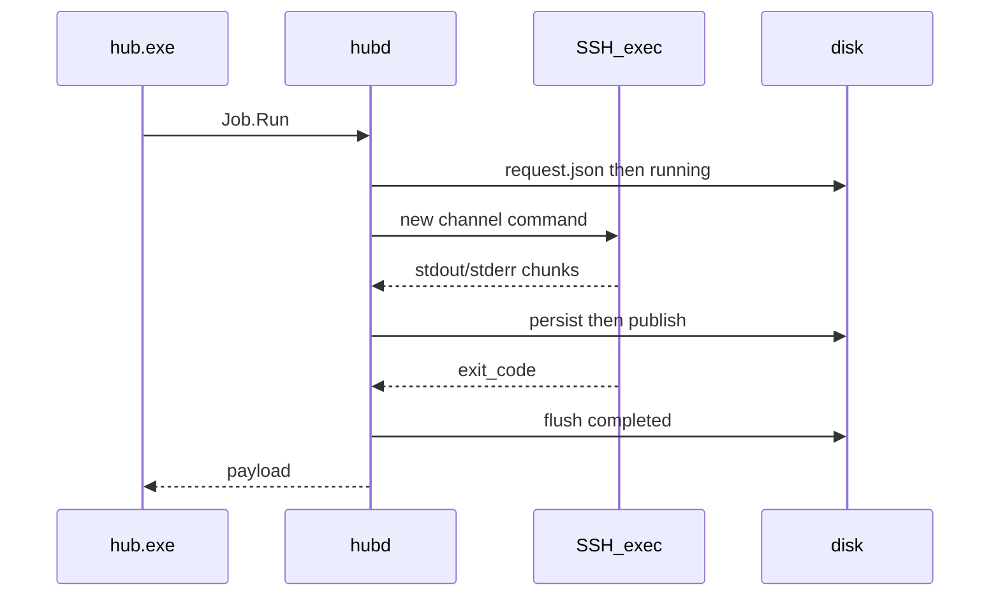

# 02 hub run

远程一次性命令。维护、排错的默认动作。独立 SSH exec channel，**不**保留远端 cwd。要保留环境用 [04-session.md](04-session.md)。

## 流程



## 输入（CLI）

```text
hub run [flags] <target> -- <command...>
```

| 参数 | 必填 | 说明 |
|------|------|------|
| `target` | 是 | 别名、`user@host`、`user@host:port`、OpenSSH Host |
| `--` 后 | 是 | 拼成一条字符串发给 SSH exec，中间空格保留，Hub 不再包 `bash -lc` |
| `--timeout` | 否 | 默认 Target `default_timeout` 否则 120s |
| `--detach` | 否 | 立即返回，`status=running` |
| `--sensitive` | 否 | 不把 command 写入 request 正文 |
| `--script-file` | 否 | 本地脚本路径；用文件正文作为远端命令，避免 PowerShell 改写 |
| `--shell` | 否 | `bash` / `sh` / `powershell` / `pwsh` / `raw`。空：看 shebang，否则 raw |

IPC `Job.Run` params：

| 键 | 类型 | 必填 |
|----|------|------|
| `target` | string | 是 |
| `command` | string | 是 |
| `timeout_ms` | int | 否 |
| `allow_public` | bool | 否 |
| `jsonl` | bool | 否 |
| `detach` | bool | 否 |
| `sensitive` | bool | 否 |

## 输出（`--json`）

公共字段 +：

| 字段 | 类型 | 说明 |
|------|------|------|
| `exit_code` | int \| null | 成功结束时有；`execution_unknown` 为 null |
| `stdout` | string | 可能截断 |
| `stderr` | string | 可能截断 |
| `operation_id` | string | `job_` 前缀 |

文本模式：把 stdout 打到 stdout，stderr 到 stderr，最后一行不额外包 JSON。`--quiet` 不打印 Hub 状态行。

## 副作用

- 建 Job 与日志目录
- 可能 accept-new 内网 host key
- 复用或新建 SSH 连接（键含 user、host、port、auth_ref、hostkey、单跳 jump 身份）
- Ctrl+C：取消订阅；**不** cancel Job，除非用户再 `hub job cancel`

## 测试

| ID | 前置 | 输入 | 退出 | JSON | 副作用 |
|----|------|------|------|------|--------|
| R-01 | 内网 sshd，agent 可用 | `hub run --json user@192.168.1.20 -- uname -a` | 0 | `ok=true`，`exit_code=0`，stdout 含 Linux | 有 job 日志，known_hosts 新增可接受 |
| R-02 | 别名 `dev-web` | `hub run --json dev-web -- true` | 0 | `target=dev-web` | 连接复用第二次 R-01 同键 |
| R-03 | 远端 `false` | `hub run --json t -- false` | 1 | `ok=false`，`exit_code=1`，`REMOTE_EXIT_NONZERO` | 日志仍完整 |
| R-04 | 慢命令 | `hub run --json --timeout 2s t -- sleep 30` | 1 | `JOB_TIMEOUT` | channel 关闭 |
| R-05 | 执行中断网 | 断 TCP | 1 | `EXECUTION_UNKNOWN`，`stdout` 已收到部分 | 不重放命令 |
| R-13 | 未知 job wait | `hub job wait --json job_nope` | 1 | `JOB_NOT_FOUND` | |
| R-06 | 公网 IP 默认 scope | `hub run --json user@8.8.8.8 -- true` | 1 | `SCOPE_NOT_INTRANET` | 无 SSH 认证 |
| R-07 | 同上 | 加 `--allow-public` | 视网络 | 不再是 SCOPE | |
| R-08 | host key 已变 | 再连 | 1 | `HOST_KEY_CHANGED` | 不送钥匙 |
| R-09 | 错误密码/钥匙 | | 1 | `AUTH_FAILED`，日志无秘密 | |
| R-10 | `--detach` | `hub run --json --detach t -- sleep 60` | 0 | `status=running`，有 `operation_id` | sleep 仍在远端 |
| R-11 | COM 目标 | `hub run --json COM3 -- x` | 1 | `CAPABILITY_UNSUPPORTED` | |
| R-12 | 空命令 | `hub run --json t --` | 2 | `INVALID_ARGUMENT` | 无 Job |
