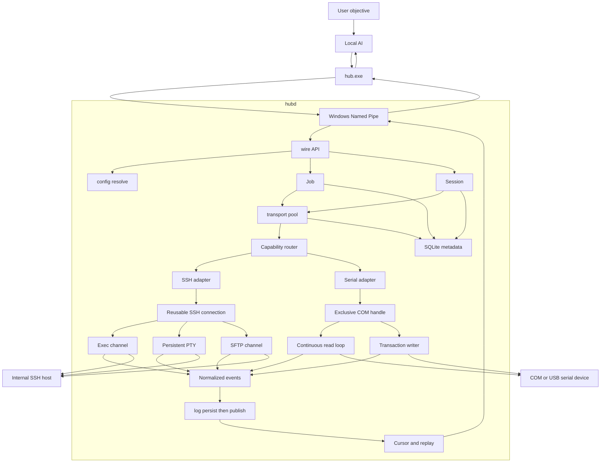
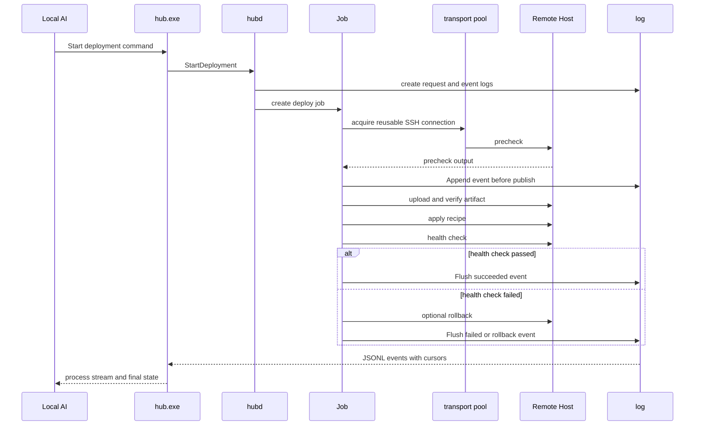
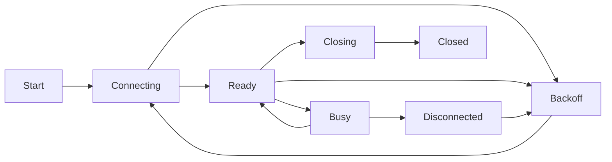
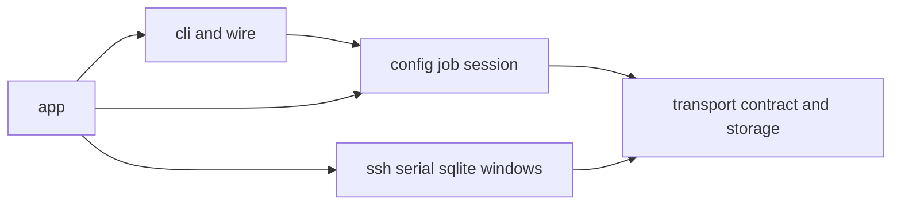

# Deckhand（本地 AI 远程工程枢纽）V1 方案设计

**状态**：V1 可落地方案（架构 + 接口契约）  
**日期**：2026-09-03  
**平台**：Windows 本机；内网 Linux SSH 主机；本机串口设备  
**定位**：本机 AI 通过 `hub.exe` 在远端做部署、维护、排错。用户只配置 SSH 或 COM。  
**最高优先级**：使用简单。  
**规范分层**：产品与架构以本文为准；**命令入参/出参/测试以 [`docs/contracts/`](contracts/README.md) 为准**，冲突时契约优先。

---

## 1. 产品原则

1. **CLI 唯一入口**：V1 不提供 MCP、HTTP API、Web 或 GUI。
2. **一条命令完成常用操作**：避免强制初始化、Target 登记及 Plan、Approve、Apply 等多段式流程。
3. **零额外权限体系**：AI 拥有用户明确给予它的权限，Hub 不再建立 RBAC。
4. **自动化默认无交互**：稳定 `--json` 输出、明确退出码，不弹出常规确认。
5. **配置尽量复用**：可导入 OpenSSH Config；串口可自动枚举。
6. **daemon 无感**：CLI 自动启动 `hubd`，用户通常不需要管理后台进程。
7. **内网默认可信**：RFC1918、链路本地、`.ssh/config` 已有 Host 视为日常目标；不分析命令、不审批。低成本保护不得打断内网第一次 `hub run`。
8. **少步骤、响失败**：能自动做的就自动做；做不到的（不支持的 ssh_config 语法、默认下的公网直连）立刻失败并给出可复制的下一命令，禁止静默降级。
9. **SSH 与串口同为 V1 能力**：公共模型不假设所有目标都有 shell、文件或退出码。
10. **长连接优先**：`hubd` 持有并复用 SSH、PTY 和串口连接，CLI 退出不终止后台任务或会话。
11. **返回可恢复**：实时输出、最终结果和会话游标均可由 AI 获取；断开后可凭 Job/Session ID 续读。
12. **操作必落盘**：请求、输入、输出、状态变化和最终结果在返回成功前写入本机日志。

---

## 2. V1 用户体验

### 2.1 用户最少需要做什么

1. 配置远端怎么连：编辑 `%LOCALAPPDATA%\LocalAIHub\connections.yaml`（SSH 或 COM）。也可直接用内网 `user@host` / `COM3` 或已有 `.ssh/config` 别名。
2. 在本地 AI 里允许执行 `hub.exe`。

不要在远端装插件。不要为 Hub 再建账号。

**AI 默认命令面（实现与 Skill 必须优先用这四个）：**

| 场景 | 命令 |
|------|------|
| 维护 / 排错 | `hub run --json <target> -- <cmd>` |
| 传文件 | `hub cp --json …` |
| 发布 | `hub deploy --json …` |
| 串口一问一答 | `hub serial exec --json …` |

未完成的长任务只用 `hub job wait` / `hub job follow`（`--detach` 之后）。不要默认 `session` / `shell` / `connection`。

进阶（人在终端、或必须保留 cwd 的连续排错）才用 `hub session`、`hub shell`、`hub serial monitor`。Job ID 仅在 `--detach` 或续读时出现。

若本地 AI 产品自身要求每次执行终端命令时确认，用户应在该产品中将 `hub.exe` 配置为可信命令。Hub 本身不设置 Approval 执行门，但不会绕过 AI 产品或操作系统的权限控制。

### 2.2 零配置首次使用

```text
hub run user@192.168.1.20 -- uname -a
hub serial exec COM3 "version" --wait ">"
```

首次调用自动：

- 创建当前用户数据目录和默认配置（`network.scope=intranet`）；
- 用与 `hub.exe` 同目录的 `hubd.exe` 拉起当前用户级 daemon（单实例）；
- 读取 `%USERPROFILE%\.ssh\config` 支持子集，因此可直接使用现有 SSH 别名；
- 内网地址或已有 OpenSSH Host **首次** host key 自动记录（`accept-new`），stderr 提示一声即可，不交互；
- 允许直接使用内网 `user@host` 和本机 `COM3`，无需预先登记 Target。

公网 IP/主机名仍可连，但要带一次 `--allow-public`（或在 `settings.yaml` 把 scope 改为 `all`）。这是给偶尔跳出去用的，不是审批。

`hub init`、`hub target add` 和串口别名仅作为可选向导，适合保存常用默认参数，不是运行前置步骤。

### 2.3 常用操作

默认面：

```text
hub run --json dev-web -- uname -a
hub cp --json ./app.tar.gz dev-web:/opt/app/app.tar.gz
hub serial exec --json COM3 "version" --wait ">"
hub deploy --json test-web --recipe artifact-service --artifact ./app.tar.gz
hub job wait --json job_01
```

进阶（非 AI 默认）：

```text
hub session open dev-web --name optimize
hub session exec optimize -- "cd /opt/app && ./verify.sh"
hub serial monitor board-01
hub shell dev-web
hub connection list --json
hub target list --json
```

所有非交互命令支持：

- `--json`：stdout 只输出稳定 JSON；
- `--timeout <duration>`：覆盖默认超时；
- `--quiet`：仅输出结果；
- `--detach`：立即返回 Job/Session ID，任务由 `hubd` 继续执行；
- `--jsonl`：逐行输出实时事件，供 AI 持续消费长连接返回；
- 非零退出码表示调用失败。

规范形式：`hub <verb> [object] [flags] [--] [payload...]`。全局 flag **只放在 verb 后面**（见 [contracts/00-envelope.md](contracts/00-envelope.md)）。
`--` 之后全部发给远端。`--jsonl` 优先于 `--json`。截断按字节且落在 UTF-8 边界。

别名：`hub jobs` → `hub job list`；`hub logs <id>` → `hub job follow <id>`；`hub shell t` → `session open` 后前台附着（无 TTY 用 `session exec`）。

### 2.4 单文件连接配置

默认只要求维护：

```text
%LOCALAPPDATA%\LocalAIHub\connections.yaml
```

示例：

```yaml
targets:
  dev-web:
    transport: ssh
    host: 192.168.1.20
    user: devops
    auth:
      type: ssh-agent

  test-web:
    transport: ssh
    host: 192.168.1.21
    user: deploy
    auth:
      type: private-key
      key_path: C:\Users\me\.ssh\id_ed25519

  board-01:
    transport: serial
    port: COM3
    baud_rate: 115200
    prompt_pattern: ">"
```

同目录还可选 `settings.yaml`（首次自动生成，不改也能用）：

```yaml
network:
  scope: intranet          # intranet | all
ssh:
  host_key: accept-new-intranet  # 内网首次自动收；变化一律阻断
daemon:
  idle_exit: 0             # 0=随用户会话常驻
limits:
  max_response_bytes: 8388608
  max_event_bytes: 262144
  max_operation_log_bytes: 104857600
  max_total_log_bytes: 1073741824
  max_concurrent_jobs: 32
  matcher_max_bytes: 65536
connection:
  idle_timeout: 30m
```

配置约束：

- SSH 密码、私钥口令和 token 不得明文写入文件，只保存 `ssh-agent`、密钥路径或 Credential Manager 引用；
- 不提供 `--password`；需要密码时用 `hub secret set <target>` 写入 Credential Manager（一次即可）；
- COM 一般没有连接认证，只配置端口、波特率、`8-N-1`、流控、编码和提示符；
- 未配置的**内网** SSH 地址、已解析的 OpenSSH 别名和 COM 口可临时直连；
- `hub target add` 只是生成或修改该文件的可选向导；
- `known_hosts`、数据库和日志由 Hub 自动维护，用户无需编辑。

---

## 3. V1 范围

### 3.1 必须实现

- `hub.exe` CLI 和 `hubd.exe` 当前用户级后台进程（非 Windows 服务）；
- CLI 用同目录绝对路径自动启动 **单实例** daemon（用户级 mutex + `runtime/hubd.lock`）；
- Windows Named Pipe 本地 IPC，仅当前用户可访问；单帧上限 16MiB；协议带版本号；
- SSH exec、PTY、SFTP、连接复用；连接键为 `user|host|port|auth_ref|hostkey`；
- 内网 `accept-new` host key；已记录指纹变化无条件阻断；公网首次需 `--allow-public`；
- OpenSSH Config **支持子集**（见 [contracts/12-config-schema.md](contracts/12-config-schema.md)）；无关关键字忽略并告警；
- 串口枚举、尽量独占打开、持续读取、写入、等待匹配、会话和断线恢复；
- SSH/串口长连接、keepalive、后台 Job、detach/attach 和断线续读；
- AI 可阻塞等待、实时 follow 或按游标增量读取后端返回；
- 可选持久 Target、内网临时直连 Target、Job、Session、Deployment 和审计；
- 命令超时、取消、输出限制和稳定错误码；
- SQLite 状态、Job/Session 完整操作日志和追加式 JSONL 审计；
- zip 或 MSI 安装包。

### 3.2 不做

- MCP Server、HTTP API、网络监听；
- Web 管理页和托盘 GUI；
- 自建用户、RBAC、集中审批；
- 多用户共享 Hub；
- 远端安装 Agent；
- WinRM、Telnet、Kubernetes Transport；
- DAP 图形调试代理；
- 串口文件传输和固件烧录协议；
- 集群编排和灰度发布；
- 动态插件系统；
- `hub daemon status`；
- 完整 OpenSSH 兼容（`Match`、多跳跳板）；V1 不做 Host 通配。

---

## 4. 权限与安全边界

### 4.1 权限继承

Hub 不创建第二套权限系统：

- `hubd` 以启动它的 Windows 用户身份运行；
- 本地文件、凭据和串口权限来自该 Windows 用户；
- SSH 权限来自 Target 配置的远端 SSH 用户；
- AI 权限来自用户授予 AI 的本机命令执行能力；
- Hub 不提权、不绕过系统 ACL、不保存额外管理员权限。
- 同用户下任何能跑 `hub.exe` 的进程都能打到同一 `hubd`（含 AI）。这是便捷模型，不是缺陷；不在 Hub 内再做身份。审计记录进程名/路径便于事后看，不拦截。
- 若 CLI 以管理员完整性运行：stderr 警告一次，仍尝试连接已有 `hubd`。**不要**再拉起第二个高完整性 daemon。若 Pipe 因完整性连不上，失败并提示用普通权限重开（不自动提权）。

因此，有效权限为：

$$
P_{effective}=P_{local\ user}\cap P_{selected\ target}
$$

其中 SSH Target 的 $P_{selected\ target}$ 是远端 SSH 账户权限；串口 Target 则是本机设备 ACL 和端口独占状态。

### 4.2 低摩擦保护

- 内网 Target 默认允许操作，不分析命令内容、不逐次审批；
- Hub 的执行 API 不包含 Approval 对象或审批状态；具有本机 CLI 执行权的 AI 可直接执行全部已解析 Target 能力；
- 凭据只保存引用或受 DPAPI/Credential Manager 保护的数据；
- 所有 Job 设置超时、取消和输出上限；并发 Job 有宽松默认上限（可改 `settings.yaml`，默认够用）；
- 操作元数据、命令输入、远端输出、状态事件和最终结果必须落盘；
- 可选 `workspace_root` **尽力**限制远端路径，不是沙箱；

### 4.3 内网范围与 host key（默认不增加步骤）

**内网判定**：先 DNS 解析，**所有**候选地址必须属于下列范围，再钉死选用的 IP 拨号（短主机名本身不算内网）。细则 [contracts/12-config-schema.md](contracts/12-config-schema.md)。

- IPv4：`10.0.0.0/8`、`172.16.0.0/12`、`192.168.0.0/16`、`169.254.0.0/16`、`127.0.0.0/8`
- IPv6：`fc00::/7`、`fe80::/10`、`::1`

`.local` / `.lan` / `.internal` 仍须解析后检查地址。

**host key：**

- 内网或已登记 Target：未知指纹 `accept-new`，记入 `known_hosts`，stderr + 审计各记一条，不询问；
- 任意目标：已记录指纹变化 → `HOST_KEY_CHANGED`，不发送认证材料；
- 解析结果为公网且 scope 仍为 `intranet`：`SCOPE_NOT_INTRANET`，提示补 `--allow-public` 或改 settings；加上之后，该次连接的未知指纹仍 `accept-new`（用户已显式要出网）；
- 认证前必须完成 host key 判定。配置了 `IdentityFile` / `key_path` 时行为同 OpenSSH `IdentitiesOnly=yes`，不把 agent 里其它钥匙送给该主机。

### 4.4 命令如何交给远端

- `hub run … -- <string>`：作为 **一条** SSH exec 载荷发送。Hub **不再**外包一层 `bash -lc`。远端是否走用户 login shell 由 sshd 决定。
- 需要可靠 exit code 且不依赖 cwd：用 `hub run`，不要用 PTY。
- `hub session exec`：见 [contracts/13-session-io.md](contracts/13-session-io.md)；`vim`/`top` 用 `hub shell` / `session write`。

---

## 5. 总体架构



### 5.1 主调用流程

所有命令同一条路径，差异只在「执行」一步（契约里各有时序图）：

1. CLI 按 `hub <verb> …` 解析（见 envelope）
2. 连接已有 `hubd`，否则同目录单实例拉起
3. Named Pipe 发送 `method` + `params`
4. 先写 `request.json` 再标 `running`
5. 解析 Target（yaml → ssh_config → 直连）并做内网 scope / 能力检查
6. 取连接并执行：`run` 新 exec channel；`serial exec` 经 **Job 门面**（内部串口 Session）；`session exec` 仅进阶 PTY；`deploy` 按 Recipe 串起 run/cp
7. 事件 **Persist 成功后才分配 cursor 并 Publish**
8. CLI 把与 IPC `payload` 同构的 JSON/JSONL 打到 stdout

AI 断开：只取消订阅，Job/Session 继续，用 `job wait/follow` 续。

部署子流程见 §5.2；`run` / `session exec` / `serial exec` 时序见对应 contracts。

### 5.2 部署子流程



### 5.3 长连接与返回恢复流程



长连接处于 `Busy` 时，单条返回固定遵循：`Receive → Persist → Publish → Receive`。只有落盘成功的事件才分配游标并发布给 AI。

| 进程 | 职责 |
|---|---|
| `hub.exe` | 唯一公开入口；解析参数、展示结果、自动启动 daemon |
| `hubd.exe` | 持有和复用长连接、串口、会话、后台任务、返回缓冲、日志、状态和审计 |

CLI 不重复实现 SSH 或串口。Named Pipe 名称含当前用户 SID，ACL 仅当前用户和 SYSTEM。V1 不监听 TCP。Pipe 消息为长度前缀；超过 16MiB 的单帧拒绝。版本不匹配返回明确错误，不半解析。

**单实例：** 先连 Pipe；失败则短时 bootstrap mutex 拉起同目录 `hubd.exe`。`hubd` 持有终身 instance mutex；lockfile 只记录 pid/版本，陈旧文件不代表活实例。见 [contracts/01-ipc.md](contracts/01-ipc.md)。

### 5.4 长连接与调用方式

- 每个 SSH 连接键 `user|host|port|auth_ref|host_key_fp` 维护可复用的 `ssh.Client`；键不同不得复用；
- 多个 exec/SFTP Channel 复用同一连接；
- 需要保留 `cwd`、环境变量、shell 状态或后台进程时，使用持久 `ssh_pty` Session；
- 每个串口设备由一个长期读取循环持有，多个 AI 读取者按游标消费同一返回流；
- Named Pipe 支持普通请求/响应和服务端事件流；CLI 中断仅取消订阅，除非显式执行 `hub job cancel` 或 `hub session close`；
- Job 和 Session 均由 `hubd` 分配稳定 ID，AI 可随时 `wait`、`follow`、`read` 或 `attach`；
- `hub connection list/status/close` 可查看和显式关闭长连接；默认按空闲超时回收，不要求 AI 主动清理；
- `hubd` 重启后恢复 SQLite 元数据与已 fsync 的 events。SSH exec/PTY **不能**重附着原 channel（exec → `execution_unknown`，PTY → `closed`）。串口可按设备身份重开同一 Session 流。见 [recovery.md](recovery.md)。
- 用户注销则进程结束；V1 不做登录后自动拉起。休眠唤醒后依赖 keepalive 失败再重连。

---

## 6. Transport 能力模型

不同 Transport 显式声明能力，调用前检查：

| Capability | SSH | Serial |
|---|---:|---:|
| `exec` | 是 | 可选，由命令/提示符适配提供 |
| `interactive` | 是 | 是 |
| `stream` | 是 | 是 |
| `transact` | 否 | 是 |
| `files` | 是 | 否 |
| `resize` | 是 | 否 |
| `exit_code` | 是 | 否 |
| `reconnect` | 是 | 是 |

公共接口：

```text
Transport
- Connect(ctx, target)
- Capabilities()
- OpenSession(ctx, options)
- Close()

ExecCapable
- Exec(ctx, command, options) -> output, exit_code

StreamCapable
- Read(ctx, after_cursor, max_bytes, wait)
- Write(ctx, bytes)
- Subscribe(ctx, after_cursor) -> event stream

TransactCapable
- Transact(ctx, request, matcher, timeout) -> matched_output

FileCapable
- Upload / Download / Stat / List
```

不把 SSH shell 语义强加给串口：串口通常没有可靠退出码、当前目录或文件系统。

---

## 7. 核心数据模型

### 7.1 Target

```text
Target
- id
- name?: unique alias
- ephemeral: bool
- transport: ssh | serial
- enabled
- connect_timeout
- default_timeout
- ssh?:
    host, port, user, auth_ref
    host_key_fingerprint
    workspace_root?
- serial?:
    port
    baud_rate
    data_bits
    stop_bits
    parity
    flow_control
    line_ending
    encoding
    prompt_pattern?
    reconnect
- created_at / updated_at
```

`user@host`、OpenSSH 别名和 `COMx` 在请求时解析成临时 Target；设置常用别名时才写入数据库。

便捷默认值：`port=22`、`baud_rate=115200`、`8-N-1`、无流控、UTF-8、换行符自动探测或 `LF`。

### 7.2 Job

```text
Job
- id
- request_id
- target_id
- kind: exec | serial_transact | file | deploy
- state: queued | running | succeeded | failed | timed_out | cancelled | execution_unknown
- command_summary
- started_at / finished_at
- exit_code?
- stdout_path / stderr_path / event_path
- next_cursor
- output_truncated
- error_code?
```

### 7.3 Session

```text
Session
- id
- target_id
- kind: ssh_pty | serial_repl
- state: opening | open | disconnected | closed | failed
- next_cursor
- input_log_path / output_log_path / event_path
- created_at / last_activity_at
```

SSH PTY 和串口均使用有界环形缓冲区与单调游标：

```text
Read(session_id, after_cursor, wait_ms)
=> data, next_cursor, events_lost, first_available_cursor, truncated, eof
```

游标为 **operation 内事件序号**（[contracts/11-output-cursor.md](contracts/11-output-cursor.md)）。环形缓冲仅低延迟；`events.jsonl` 是事实源。

### 7.4 Deployment

```text
Deployment
- id
- target_id
- recipe
- artifact_sha256?
- deploy_status: running | verifying | rolling_back | succeeded | rolled_back | failed | rollback_failed
- current_step
- started_at / finished_at
```

部署是一个 Job 的结构化视图，不引入 Approval。Recipe 由本机用户配置；AI 可直接调用。仅 `deploy` 和显式 `--idempotency-key` 的请求写入幂等索引；普通 `hub run` 默认每次都执行。

---

## 8. SSH 后端

- 使用 `golang.org/x/crypto/ssh`；SFTP 使用 `github.com/pkg/sftp`；
- 支持 `ssh-agent`、OpenSSH 私钥和 Windows 受保护凭据；
- 连接按连接键长期复用，keepalive 探活；失效后自动重建，**不重放**已发出的 exec/write；
- `hub run` / `hub cp`：复用连接上的独立 Channel，stdout/stderr 分离，有 exit code；
- `hub session exec`：随机 nonce 的 POSIX 标记，同 PTY 串行；**不宣称** PTY exit 可靠。见 13-session-io。
- `hub job cancel`：关闭对应 Channel。远端进程可能仍在（sshd 常见）。状态为 `cancelled` 只表示本端停止等待。若断线发生在退出码到达前，Job 为 `execution_unknown`，错误码 `EXECUTION_UNKNOWN`，已有输出保留；
- host key 策略见 §4.3；
- OpenSSH：精确 Host；关键不支持项失败；`ServerAliveInterval` 等忽略并告警。见 [contracts/12-config-schema.md](contracts/12-config-schema.md)。
- PTY 支持输入、输出、窗口 resize、detach/attach 和可靠关闭；
- SFTP 上传先写临时文件，校验 SHA-256 后 rename；不跟随逃出 `workspace_root` 的符号链接（未配置 root 则只防 `..` 到意外前缀，其余跟远端账户）；
- 配置 `workspace_root` 时，规范化后的远端文件路径不得越界。

---

## 9. 串口后端

串口是 V1 基础 Transport，不是后补功能。

### 9.1 端口管理

- 使用 `go.bug.st/serial`；
- 枚举端口及可获得的 USB VID、PID、序列号和描述；
- 每个物理端口由内部 Serial Session 占用；第二次 `monitor`/`exec` 附着同一 `session_id`；
- Windows 串口驱动不一定能挡住其它进程：若打开失败则 `SERIAL_BUSY`，不假装 OS 级互斥；
- matcher 窗口不超过 `matcher_max_bytes`；`line_ending` 固定 LF；exec 为 best-effort 时间窗匹配；
- 打开时应用波特率、数据位、停止位、校验位和流控；
- 关闭、进程退出和设备拔出时可靠释放句柄。

### 9.2 连续读取

- 打开端口后立即启动唯一读取循环；
- 原始字节写入每个 Session 的有界环形缓冲区；
- 同时通知 monitor 和等待匹配请求；
- 不按行读取，避免二进制片段和不完整行丢失；
- 展示层根据 Target 的 encoding 和 line ending 解码；
- 解码失败时 JSON 结果额外提供 Base64 原始数据。

### 9.3 写入与事务

`hub serial exec` 执行以下原子过程：

1. 获取该端口的写锁；
2. 记录当前 **事件** 游标；
3. 写入命令及 **LF**；
4. 在窗口内等待 matcher（可能混入异步日志）；
5. 匹配成功返回响应；超时返回已收到的部分数据；
6. 释放写锁。

同一端口可有多个只读观察者，但同一时刻只有一个事务写入，避免响应串线。

### 9.4 断线与重连

- 设备拔出后 Session 进入 `disconnected`；
- `reconnect=true` 时：**有 USB 序列号则只认同一序列号**；否则 VID+PID+**同一端口名**。禁止仅凭 VID/PID 接到另一块同型号板子上延续游标；
- 指数退避且设置最大间隔；
- 重连成功继续原 Session 和游标；
- 断线中的事务立即失败，不自动重放写入；
- 磁盘将满或日志不可写：停止该口新事务并失败，读循环可停，不得伪造成功；
- 所有状态变化进入审计。

---

## 10. 部署与运维

部署保持简单：


示例：

```text
hub deploy dev-web --recipe artifact-service --artifact ./app.tar.gz
```

Recipe 可定义：

- 前置检查命令；
- 上传位置和 SHA-256 校验；
- 安装、启动或重启命令；
- **仅远端** `verify.command` 健康检查（不从本机打 HTTP/TCP）；
- 可选 rollback 命令（只跑 Recipe 所写，无通用备份）。

运维直接使用 `hub run`，不额外设计庞大工具目录。例如服务状态、日志、进程、磁盘、容器命令都由远端用户原有工具完成。

串口设备可用 `serial exec` 完成版本查询、配置、诊断和 REPL 调试；V1 不承诺串口部署文件或固件。

---

## 11. CLI / IPC 契约

字段、错误码、测试用例不在本文重复维护，见：

- [contracts/00-envelope.md](contracts/00-envelope.md) — 错误码与 argv
- [contracts/01-ipc.md](contracts/01-ipc.md) — `kind` 帧；单连接单请求
- [contracts/10-state-machines.md](contracts/10-state-machines.md) — 状态与 `ok`
- [contracts/11-output-cursor.md](contracts/11-output-cursor.md) — 事件游标
- 其余 verb 见 [contracts/README.md](contracts/README.md)

`--json` 形状（`run` 成功）示意：

```json
{
  "ok": true,
  "request_id": "req_01",
  "operation_id": "job_01",
  "target": "dev-web",
  "status": "succeeded",
  "exit_code": 0,
  "stdout": "Linux ...\n",
  "stderr": "",
  "truncated": false
}
```

---

## 12. 数据与审计

```text
%LOCALAPPDATA%\LocalAIHub\
  connections.yaml
  settings.yaml
  recipes\
  hub.db
  known_hosts
  audit\YYYY-MM-DD.jsonl
  jobs\<job-id>\request.json
  jobs\<job-id>\stdout.log
  jobs\<job-id>\stderr.log
  jobs\<job-id>\events.jsonl
  sessions\<session-id>\input.log
  sessions\<session-id>\output.log
  sessions\<session-id>\events.jsonl
  runtime\
```

SQLite 保存 operation/session/deployment/幂等记录和 `resolved_target_snapshot`。不存 Target 配置表。私钥正文和明文密码不进入数据库。

### 12.1 落盘规则

- 每次操作先创建 `request.json`，再进入 `running`；无法建立日志文件则操作失败，不静默无日志执行；
- stdout、stderr、串口原始返回、PTY 输入输出和状态事件边接收边追加写入；
- 操作日志记录完整时间线；明确标记为 secret 的输入仅记录类型、长度和时间，不记录秘密值；
- SQLite 保存索引、状态、游标、文件路径和最终结果，不保存大段输出；
- 输出采用有界批量 flush；Job 完成前强制 flush 输出和最终 `completed` 事件，再向 CLI 返回成功；
- AI/CLI 意外断开不删除日志，也不终止后台 Job；
- 默认保留 `retain_days` 且总容量不超过 `max_total_log_bytes`；运行中日志不删；
- `hub logs` / `hub session logs`（后者即 `session read` 别名）可读历史；
- 终态与 `started` 必须 fsync 后再对外确认；chunk 可批量 flush；
- 文本日志写入前脱敏明显的 token、密码、私钥 PEM；`command_summary` 截断到短长度。不保证脱敏完备，审计不能当机密保险柜；
- 审计事件保存时间、客户端可执行文件路径、Target、完整操作关联 ID、结果和前一事件哈希。同用户可删日志；哈希链只用于发现缺口。

审计不作为权限系统，不引入 Approval；日志落盘属于执行可靠性要求。

---

## 13. 技术选型与代码结构

对外已经够简单：一个 CLI、自动 `hubd`、四个默认 verb。内部再少接线：11 个包，扩展点只留 Transport 注册。不按「一职责一目录」拆到 18 个包。

| 层 | 选择 |
|---|---|
| 语言 | Go 1.24+ |
| CLI | `cobra` |
| IPC | Windows Named Pipe |
| SSH | `golang.org/x/crypto/ssh` |
| SFTP | `github.com/pkg/sftp` |
| Serial | `go.bug.st/serial` |
| 状态 | SQLite，优先纯 Go 驱动 |
| 配置 | YAML |
| 审计 | JSONL 追加写 + 哈希链 |
| 凭据 | ssh-agent、Windows Credential Manager/DPAPI |
| 安装 | zip 或 MSI，两个 exe |

### 13.1 目录结构

采用模块化单体。**使用简单优先于包数量**：用户只记四个默认命令；内部少包、少接线。V1 不实现动态插件；新通道只加 `transport/<name>`。

```text
local-ai-hub/
├─ cmd/
│  ├─ hub/                 # CLI main
│  └─ hubd/                # daemon main
├─ internal/
│  ├─ app/                 # 装配、单实例、启动关闭、崩溃扫描
│  ├─ wire/                # DTO + Named Pipe
│  ├─ cli/                 # argv、渲染、拉起 hubd
│  ├─ config/              # YAML、OpenSSH、Target 解析 / DNS scope
│  ├─ job/                 # Job、Serial.Exec 门面、Recipe 部署
│  ├─ session/             # SSH PTY；串口端口租给 job
│  ├─ log/                 # events.jsonl、cursor、审计 JSONL
│  ├─ storage/             # SQLite
│  ├─ secrets/             # agent / 密钥路径 / Credential Manager
│  ├─ transport/
│  │  ├─ contract/
│  │  ├─ registry/
│  │  ├─ pool/             # 连接键、租约、keepalive
│  │  ├─ ssh/
│  │  └─ serial/
│  └─ platform/windows/
├─ migrations/
├─ configs/
├─ docs/                   # v1-design + contracts/（唯一字段契约）
├─ test/
├─ go.mod
└─ go.sum
```

### 13.2 依赖规则



- `cmd` / `app` 只装配；`cli` 只依赖 `wire`，不 import `transport/ssh`。
- `job` 与 `session` 只依赖 `transport/contract`、`log`、`storage`，不判断具体库类型。
- SSH 与 Serial 包互不 import。
- 模块间只传 ID、领域对象、标准事件；goroutine 由 context / WaitGroup 管。
- 新 Transport：实现 contract → registry 注册 → 契约测试；不改 `cli`/`job`（除非新能力）。
- **维护约定：** 字段只改 `docs/contracts/`。AI 默认路径不得依赖 `session`/`shell`。`Serial.Exec` 只走 `job` 门面。

### 13.3 模块动作与边界

| 包 | 做什么 | 不做什么 |
|----|--------|----------|
| `app` | 目录、迁移、mutex、接线、按 recovery 扫描 | 解析 argv、打 SSH |
| `wire` | 帧、`kind`、DTO、错误码 | 业务、落盘 |
| `cli` | 默认/进阶命令、`--json`、拉起 daemon | 持有连接 |
| `config` | yaml、OpenSSH 子集、别名/`user@host`/`COMx`、DNS scope | 建连、读秘密正文 |
| `job` | run/cp/serial exec/deploy 生命周期与 Recipe | 交互 PTY；保证远端进程被杀 |
| `session` | PTY I/O；串口读循环租给 job | 对外第二套 serial exec 状态；宣称 PTY exit 可靠 |
| `log` | 事件游标、fsync 终态、审计脱敏与哈希链 | 授权 |
| `storage` | operations 等表、CAS | Target 真值（在 YAML）；stdout 正文 |
| `secrets` | 引用解析、secret set | 写进日志/SQLite |
| `transport/*` | 能力、池、ssh、serial | Job 状态、CLI |
| `platform/windows` | SID、Pipe ACL、拉起进程 | 领域规则 |

**刻意不拆的：** Target 解析并进 `config`（同一份 yaml/ssh_config）。部署并进 `job`（deploy 就是带阶段的 Job）。连接池并进 `transport/pool`。审计并进 `log`（同一条 Persist 路径）。DTO 与 Pipe 并进 `wire`。

**刻意不并的：** `job` 与 `session`（一次性 vs 长交互）；`log` 与 `storage`（字节流 vs 元数据）；`secrets` 单独（禁止进日志的边界）。

### 13.4 核心动作编排

| 用户/AI 动作 | 主协调 | 调用链 | 返回方式 |
|---|---|---|---|
| `hub run` | `job` | config → pool → SSH exec → log → storage | text、JSON 或 JSONL |
| `hub cp` | `job` | config → pool → SFTP → hash/rename → log | 进度事件和最终文件结果 |
| `hub shell` | `session` | config → pool → SSH PTY → log | 交互流；可 detach/attach |
| `hub session exec` | `session` | nonce 标记；串行 | 可解析的 exit，非可靠 |
| `hub secret set` | `secrets` | 无回显 → Credential Manager | 无秘密正文 |
| `hub connection status` | `transport/pool` | id 或 target | JSON 状态 |
| `hub serial monitor` | `session` | config → serial handle → read loop → log | 持续 JSONL/文本流 |
| `hub serial exec` | `job` | Job 门面 → 内部租用 serial Session → transact → 只发布 Job 事件 | 一个 `job_`；续读用 `job wait/follow` |
| `hub deploy` | `job` | precheck → SFTP → exec → verify → rollback | 阶段事件和最终状态 |
| `hub job follow/read` | `log` | operation ID + cursor → disk replay → live subscribe | 有序 JSONL 事件 |
| `hub connection close` | `transport/pool` | stop leases → close adapter → record state | 连接关闭结果 |

### 13.5 扩展一个新 Transport 的步骤

1. 在独立目录实现基础 `Transport`；
2. 只实现协议真实具备的 Capability；
3. 将协议错误映射为稳定错误码；
4. 把原始返回转换成标准 Output Event；
5. 实现可靠关闭、超时和断线语义；
6. 在 `transport/registry` 编译期注册；
7. 通过全部基础 Transport 契约测试和该协议专属测试；
8. 若无需新动作，不改 `cli`、`job`、`session`、`wire`；若确需新能力，先改 `docs/contracts/` 再扩接口。

---

## 14. 开发里程碑

### M0：Transport 技术验证

- Windows Named Pipe 当前用户 ACL、最大帧、单实例 mutex；
- SSH host key（内网 accept-new / 变化阻断 / 公网需开关）、exec、SFTP、PTY 结束标记；
- OpenSSH 子集解析与不支持关键字失败；
- 串口枚举、打开失败映射 `SERIAL_BUSY`、持续读写、等待匹配、拔插和释放；
- SSH 与串口能力模型验证。

**退出条件**：真实 Linux VM 和真实/虚拟 COM 设备均通过冒烟测试。

### M1：可用 CLI 核心

- `hubd`、CLI 自动启动和 IPC；
- 自动初始化、可选 Target 向导、OpenSSH Config 直接解析；
- `hub run`、`hub cp`、`hub serial exec`、`hub deploy`（AI 默认面）；
- `hub job wait/follow`；
- 进阶：`hub session` / `hub shell` / `hub serial monitor`；
- 长连接复用、持久 PTY、后台 Job、detach/attach；
- `--json` 最终结果、`--jsonl` 实时事件、游标续读；
- Job/Session 输入输出和事件日志强制落盘；
- Job、Session、超时、取消和审计。

**退出条件**：新用户安装后，无需先初始化，即可完成内网 SSH 命令和串口命令；十分钟内完成文件上传。契约表 R-01、S-01、C-01 通过。

### M2：部署闭环

- Recipe；
- Artifact 哈希与上传；
- Apply、健康检查和可选回滚；
- 崩溃恢复和幂等记录。

**退出条件**：一条 CLI 命令完成测试应用升级；故障注入后正确报告并回滚。

### M3：发布质量

- zip/MSI 安装；
- 配置迁移和备份；
- SSH、串口和 Windows 端到端测试；
- CLI 帮助、AI 调用示例和故障诊断文档。

**退出条件**：干净 Windows 环境完成全部验收场景。

---

## 15. 测试方案

命令级用例以 [`docs/contracts/`](contracts/README.md) 各文件的测试表为 **golden**（R-01、S-01、D-01 等）。本节保留模块/故障/E2E 矩阵；ID 冲突时以契约表为准。

### 15.1 测试层级

| 层级 | 目的 | 外部依赖 | 执行频率 |
|---|---|---|---|
| 单元测试 | 验证单模块纯逻辑、状态机和边界 | 全部替身 | 每次提交 |
| 契约测试 | 保证所有 Transport/Repository/Output Adapter 行为一致 | Adapter 可用仿真 | 每次提交 |
| 集成测试 | 验证模块组合及真实库行为 | 测试 sshd、虚拟 COM、临时 SQLite | 每次提交/夜间 |
| 故障测试 | 验证断网、拔线、磁盘满、崩溃等恢复语义 | 可控故障环境 | 夜间/发布前 |
| CLI 端到端 | 从 `hub.exe` 到目标验证用户场景与 JSON 契约 | Windows + 测试目标 | 发布前 |
| 真实设备冒烟 | 验证驱动、USB 串口和真实 Linux 差异 | 实机 | 发布候选版 |

测试原则：

- 时间、随机 ID、文件系统、连接和重试时钟必须可注入替身；
- 测试通过公开模块接口，不读取模块内部字段；
- 共享 Transport 契约测试不得复制到各 Adapter；
- 并发测试启用 Go race detector；
- 每个故障用例必须断言状态、返回、落盘日志、审计和资源释放；
- JSON/JSONL 使用 schema/golden 契约，新增字段允许，删除或改义失败；
- 禁止依赖固定 `Sleep`；使用事件、虚拟时钟或最终一致断言。

### 15.2 模块单元测试矩阵

| ID | 模块 | 场景 | 关键断言 |
|---|---|---|---|
| U-CLI-01 | `cli` | daemon 不存在时执行 `hub run` | 仅拉起一次；连接后转发原请求 |
| U-CLI-02 | `cli` | `--json`/`--jsonl`/文本模式 | stdout 无污染；stderr 分离；退出码稳定 |
| U-CLI-03 | `cli` | `--` 后含 Hub 同名参数 | 全部原样发送远端 |
| U-PRO-01 | `wire` | IPC 新增可选字段 | 旧客户端仍可解码；未知字段忽略 |
| U-IPC-01 | `wire` | 慢订阅者 | 有界背压；不阻塞 Job；可凭游标续读 |
| U-TGT-01 | `config` | alias、内网 `user@host`、OpenSSH alias、`COM3` | 解析为正确 Transport 和默认值 |
| U-TGT-03 | `config` | 公网 IP 且 scope=intranet | `SCOPE_NOT_INTRANET`；`--allow-public` 后通过 |
| U-TGT-02 | `config` | 同名来源冲突 | 优先级确定；错误包含来源 |
| U-CFG-01 | `config` | 写配置时进程中断 | 原文件完整；临时文件可清理 |
| U-SEC-01 | `secrets` | 获取 secret 后输出日志 | 日志与错误中不出现 secret |
| U-CON-01 | `transport/pool` | 并发获取同一 Target | 只建立一个底层连接；租约计数正确 |
| U-CON-02 | `transport/pool` | keepalive 失败 | 单次重连循环；指数退避；无 goroutine 泄漏 |
| U-CON-03 | `transport/pool` | 空闲回收与显式关闭竞争 | 只关闭一次；调用者收到确定状态 |
| U-JOB-01 | `job` | 正常、失败、超时、取消、`execution_unknown` | 状态转换合法且只有一个终态 |
| U-JOB-02 | `job` | CLI 订阅断开 | Job 继续；最终状态和日志完整 |
| U-SES-01 | `session` | detach 后 attach | Session 不关闭；从指定游标续读 |
| U-SES-02 | `session` | 游标早于环形缓冲 | 从磁盘补读；仅缺口时 `events_lost` |
| U-SES-03 | `session` | `session exec` nonce 标记 | 无 nonce 不结束；无标记不假成功 |
| U-OUT-01 | `log` | 并发 stdout/stderr | **operation 内**单调 cursor；每事件只落盘一次 |
| U-OUT-02 | `log` | 磁盘写失败 | 不发布未持久化事件；Job 失败并报告日志错误 |
| U-OUT-03 | `log` | Job 完成 | 最终事件 flush 后才向调用者报告成功 |
| U-AUD-01 | `log` | token、密码、私钥样本 | 全部脱敏；事件哈希链可验证 |
| U-DEP-01 | `job` | verify 失败且有 rollback | 顺序正确；最终状态 `rolled_back` 或 `rollback_failed` |
| U-DEP-02 | `job` | 相同幂等指纹 | 不重复 apply；返回原 job_ |
| U-DEP-03 | `job` | 同 key 不同指纹 | `IDEMPOTENCY_CONFLICT` |

### 15.3 Transport 共享契约测试

每个 Transport Adapter 必须运行适用的共享套件：

| ID | 契约 | 场景 | 通过标准 |
|---|---|---|---|
| C-TRN-01 | 生命周期 | Connect → Close → Close | 第二次关闭无副作用，不泄漏资源 |
| C-TRN-02 | Capability | 请求未声明能力 | 返回 `CAPABILITY_UNSUPPORTED`，不调用底层设备 |
| C-TRN-03 | 超时 | 操作超过 context deadline | 有界时间内退出，状态与错误码一致 |
| C-TRN-04 | 取消 | 运行中 cancel | 停止等待，释放 Channel/锁，保留已有输出 |
| C-TRN-05 | 输出 | 后端分片返回 | 不丢字节，事件顺序及游标正确 |
| C-TRN-06 | 断线 | 返回中连接丢失 | 已有输出落盘；状态明确，不假定执行失败或成功 |
| C-TRN-07 | 并发 | 多 Channel/观察者 | 无数据竞争；不相互关闭连接 |
| C-TRN-08 | 重连 | 后端恢复 | 建立新连接；不自动重放不安全写操作 |

Repository Adapter 运行事务、并发、迁移、幂等唯一索引和崩溃恢复共享测试。`log` 运行 append、flush、replay、cursor、rotation 和磁盘错误共享测试。

### 15.4 SSH 集成测试

使用隔离测试 sshd：

| ID | 场景 | 关键断言 |
|---|---|---|
| I-SSH-01 | ssh-agent、私钥、错误凭据 | 正确认证；失败映射 `AUTH_FAILED`；日志无秘密 |
| I-SSH-02 | 首次和变化 host key | 内网首次记录；变化阻断且不发送认证信息；公网无开关则拒绝 |
| I-SSH-03 | 连接复用与并发 exec | 单个 Client、多 Channel；stdout/stderr/exit code 正确 |
| I-SSH-04 | 长输出、超时、取消 | 输出完整落盘；响应有界；Channel 被释放 |
| I-SSH-05 | keepalive 断线重连 | 连接状态可观测；新请求使用新连接 |
| I-SSH-06 | 持久 PTY | 多次命令保留 cwd/环境；detach 不退出 shell |
| I-SSH-07 | SFTP 上传 | 临时文件、SHA-256、原子 rename；中断无半成品 |
| I-SSH-08 | Workspace 边界 | `..` 尽力拒绝；不作为沙箱承诺 |

### 15.5 串口集成测试

使用虚拟串口对，并对至少一种真实 USB 串口设备做冒烟：

| ID | 场景 | 关键断言 |
|---|---|---|
| I-SER-01 | 枚举与参数配置 | 返回端口元数据；正确应用 baud、8-N-1、流控 |
| I-SER-02 | 二次 monitor/exec 同口 | 同一 `session_id`；OS 打开失败才 `SERIAL_BUSY` |
| I-SER-03 | 分片、无换行和二进制返回 | 原始字节不丢失；解码失败提供 Base64 |
| I-SER-04 | matcher 跨多个 read 分片 | 正确匹配并返回完整事务区间 |
| I-SER-05 | matcher 超时 | 返回 `SERIAL_TIMEOUT` 和已落盘部分输出 |
| I-SER-06 | 并发事务 | 写入严格串行；响应不串线；观察者持续收到数据 |
| I-SER-07 | 设备拔出 | Session 转 `disconnected`；等待者立即失败；无死锁 |
| I-SER-08 | 设备重插 | 按 USB 序列号（否则端口名+VID/PID）重连；游标延续；不重放旧写入；同型号另一口不误接 |
| I-SER-09 | daemon 关闭 | 句柄释放；其他程序可立即打开端口 |

### 15.6 IPC、落盘与恢复测试

| ID | 场景 | 关键断言 |
|---|---|---|
| I-IPC-01 | 当前用户连接 Pipe | 请求、取消和事件订阅正常 |
| I-IPC-02 | 其他 Windows 用户连接 | ACL 拒绝，Hub 不收到业务请求 |
| I-IPC-03 | CLI 在流中途崩溃 | Job/Session 继续；订阅资源释放 |
| I-LOG-01 | 正常操作 | request、stdout/stderr、events、audit 均存在且可关联 |
| I-LOG-02 | 日志目录不可写/磁盘满 | 操作不执行或转明确失败；不得返回伪成功 |
| I-LOG-03 | daemon 在输出中崩溃 | 已 flush 数据可读；启动后未完成状态被恢复/标记 |
| I-LOG-04 | 按游标重放再切 live | 无缺口、无重复；顺序与原始事件一致 |
| I-LOG-05 | 保留策略 | 不删除运行中、保留或近期失败日志；安全清理过期日志 |
| I-DB-01 | 从上一 schema 升级 | migration 原子完成；旧数据可读；失败可回滚 |

### 15.7 故障测试

| ID | 故障注入 | 预期行为 |
|---|---|---|
| F-01 | SSH 执行中断网 | 已有输出保留；Job 为 `execution_unknown`，不标 `failed`/`succeeded`，不自动重放 |
| F-02 | 串口事务中拔线 | 立即解除等待和写锁；部分返回落盘；重连不重发命令 |
| F-03 | `log` 写失败 | 停止发布新事件；操作失败；审计记录日志故障 |
| F-04 | SQLite 暂时锁定 | 有界重试；无重复 Job；最终结果明确 |
| F-05 | `hubd` 被强制终止 | 重启后恢复日志和元数据；真实连接标记断开并重连 |
| F-06 | CLI 重复启动 daemon | mutex 生效；最终只有一个实例持有 Pipe 和数据库 |
| F-07 | 超大/高速输出 | 内存有界；磁盘日志连续；慢 AI 可续读 |
| F-08 | 系统时间跳变 | 游标顺序不变；持续时间使用单调时钟 |

### 15.8 CLI 端到端场景

| ID | 用户场景 | 完成标准 |
|---|---|---|
| E2E-01 | 零配置内网 SSH 直连 | CLI 自动启动单实例 daemon；执行成功；JSON 合法；日志齐全 |
| E2E-02 | AI 环境优化 | 同一持久 PTY 内检查→修改→验证；无需 Hub Approval；结果可追溯 |
| E2E-03 | AI 中途断开 | 后台 Job 继续；新 CLI 凭 ID/游标取得完整返回和终态 |
| E2E-04 | 串口诊断 | monitor 启动→事务查询→拔插→重连；输出顺序正确且落盘 |
| E2E-05 | 文件部署成功 | 一条命令完成上传、apply、健康检查；状态 `succeeded` |
| E2E-06 | 部署验证失败 | 自动执行配置的 rollback；最终状态和各阶段日志准确 |
| E2E-07 | 权限不足 | 返回远端/系统真实拒绝；Hub 不提权；错误可供 AI 判断下一步 |
| E2E-08 | 日志审计追踪 | 由最终 Operation ID 定位请求、全部返回、事件和审计链 |

### 15.9 发布门禁

- 单元和契约测试全部通过；
- 核心模块覆盖率目标不低于 80%，状态机、游标、日志和重连分支不低于 90%；
- race detector 无报告；
- JSON/JSONL 兼容契约无破坏；
- SSH、虚拟串口、IPC、落盘和部署 E2E 全通过；
- Windows 干净环境和真实串口设备冒烟通过；
- 无 goroutine、文件、Named Pipe、SSH Channel、SSH Client 或 COM 句柄泄漏；
- 故障测试不存在伪成功、无日志执行或不安全自动重放。

---

## 16. V1 验收条件

- 无配置时对**内网** SSH 或本机串口直接执行可自动完成初始化；
- CLI 首次调用可自动启动单实例 `hubd`（同目录 exe）；
- 公网直连默认失败并提示 `--allow-public`，加上后即可用；
- AI 仅靠 CLI 和 `--json`/`--jsonl` 即可稳定调用所有 V1 功能；
- AI 可通过 `--jsonl` 实时取得长连接事件，也可凭游标或 Job/Session ID 续读；
- SSH 连接、持久 PTY 和串口连接由 `hubd` 长期持有并复用；连接键不正确时不得串账号；
- AI 断开不丢失后端输出、不默认终止任务，重连后可取得历史和最终状态；
- 常用 SSH exec、文件复制和部署各可用一条命令完成；
- SSH 权限与远端用户一致，无自建 RBAC 或逐次审批；
- Hub 内不存在需要绕过的 Approval 执行门；AI 可按用户已授予权限直接优化内网环境；
- 内网新 SSH host key 自动记录；变化的 host key 必须阻断；
- `hub run` 有可靠 exit code；`session exec` 靠结束标记，无标记不报假成功；
- 断线未收到退出码时 Job 为 `execution_unknown`；
- 串口可枚举、配置、打开、监控、写入和等待匹配；打开冲突为 `SERIAL_BUSY`；
- 串口拔出不会卡死 daemon，按序列号重连，关闭后句柄可靠释放；
- 不支持的 Transport 操作返回 `CAPABILITY_UNSUPPORTED`；不支持的 ssh_config 返回 `OPENSSH_UNSUPPORTED`；
- 命令具有超时、取消、输出上限和稳定退出结果；取消不保证远端进程已死；
- 所有操作的请求、输入、输出、事件和最终结果均按规则落盘，并有尽力而为的脱敏审计；
- 一条命令完成部署、健康检查，并在失败时执行配置的回滚；健康检查默认不出目标机/内网；
- 完成 SSH 开发、串口调试、应用部署和服务运维四条端到端场景。

---

## 17. 后续方向

- MCP 薄适配器、可选 Agent Skill（只调现有 CLI）；
- 多跳 ProxyJump、端口转发、完整 ssh_config；
- Unix socket / Linux 打包；
- DAP 调试代理；
- 串口文件传输、固件烧录和设备协议插件；
- WinRM、Kubernetes exec；
- 可选 GUI；
- 真正出现多人共享需求后，再设计团队身份和 RBAC。

---

## 18. 最终决策

1. 使用便捷性是第一优先级；默认按内网设计。安全措施不得打断第一次内网 `hub run user@192.168.x.x`；
2. 公网、不支持的 ssh_config、host key 变化：失败要响、修复要短（一个 flag 或改 yaml），不要审批流；
3. V1 只公开 CLI，提供稳定 `--json`/`--jsonl` 给本地 AI；
4. CLI 自动管理单实例 `hubd`，内网地址、OpenSSH 子集别名和 COM 口直连，常用操作一条命令完成；
5. 权限直接继承本机用户、远端 SSH 用户和串口设备 ACL；同用户全权使用 Pipe 是刻意选择；
6. 不自建 RBAC，不分析命令风险，不设置 Approval 执行门；
7. SSH 与串口均为 V1 Transport；`hub run` 与 `session exec` 语义分开；
8. `hubd` 长期持有并复用连接，是唯一 Session、Job、返回流、状态和审计持有者；
9. 内网 host key 首次自动收，变化阻断；凭据保护、超时、取消和审计保留；
10. AI 可实时、阻塞或断线续读；CLI 退出不导致结果丢失；未知退出码用 `execution_unknown`；
11. 请求、输入、输出、状态事件和最终结果必须落盘；
12. 采用 Go 模块化单体，先做好 CLI、SSH、串口和部署闭环，再扩展 MCP 等入口。
